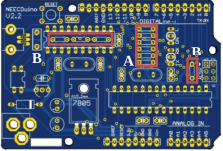
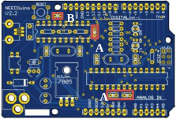
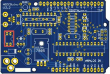
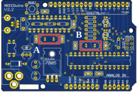
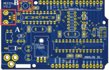

1º Passo:

Soldar as resistências:

A: (6x) 100Ω (Castanho, Preto, Vermelho).

B: (4x) 10kΩ (Castanho, Preto, Laranja).

2º Passo:

Soldar os condensadores:

A: (3x) 100nF.

B: (1x) 330nF.

**NOTA:** consultar a última página para saber qual o
condensador a utilizar.

3º passo:

Soldar PMOS (circuito integrado com 4 pinos).

**NOTA:** atenção que os pinos que estão pegados
devem estar orientados para cima, juntos ao conetor
USB.

4º passo:

Soldar o díodo.
NOTA: a orientação do díodo é relevante.

5º passo:

Soldar os cristais :

A: (1x) Cristal de12MHz.

B: (1x) Cristal de16MHz.

**NOTA:** consultar a última página para saber qual o
cristal a utilizar.

6º passo:

Soldar :

A: (1x) Conetor USB.

B: (1x) Botão.
