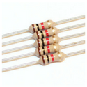
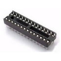
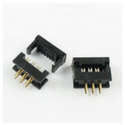

# NEECduino

# Material list

| Components | Quantity | Image |
| -----------|----------|-------|
| PCB NEECDuino | 1 |  |
| Resistência 1kOhm (ou 100Ohm) 1/8W | 6 |  |
| Resistência 10kOhm 1/8W | 4 |  |
| Condensadores 100nF | 3 |  |
| Condensador 330nF | 1 |  |
| PMOS | 1 |  |
| Diodo | 1 |  |
| Cristal 16MHz | 1 |  |
| Cristal 12MHz | 1 |  |
| Conector USB-B mini | 1 |  |
| Botão reset | 1 |  |
| Regulador 5V | 1 |  |
| Regulador 3.3V | 1 |  |
| Condensador 1uF | 1 |  |
| Condensadores 22pF | 4 |  |
| Socket 20 pinos | 1 |  |
| Socket 28 pinos | 1 |  |
| Header fêmea 10 pinos | 1 |  |
| Header fêmea 8 pinos | 2 |  |
| Header fêmea 6 pinos | 1 |  |
| LED Bicolor (Laranja/Verde) | 2 |  |
| Condensador 47uF | 2 |  |
| PTC Fuse | 1 |  |
| Header macho 2x3 | 1 |  |
| Conector DC | 1 |  |
| ATMega 328 (com bootloader) | 1 |  |
| PIC 18F14K50 (programado) | 1 |  |

# Guia de Montagem

1º Passo:

Soldar as resistências:

A: (6x) 100Ω (Castanho, Preto, Vermelho).

B: (4x) 10kΩ (Castanho, Preto, Laranja).

2º Passo:

Soldar os condensadores:

A: (3x) 100nF.

B: (1x) 330nF.

**NOTA:** consultar a última página para saber qual o
condensador a utilizar.

3º passo:

Soldar PMOS (circuito integrado com 4 pinos).

**NOTA:** atenção que os pinos que estão pegados
devem estar orientados para cima, juntos ao conetor
USB.

4º passo:

Soldar o díodo.

**NOTA:** a orientação do díodo é relevante.

5º passo:

Soldar os cristais :

A: (1x) Cristal de12MHz.

B: (1x) Cristal de16MHz.

**NOTA:** consultar a última página para saber qual o
cristal a utilizar.

6º passo:

Soldar :

A: (1x) Conetor USB.

B: (1x) Botão.
